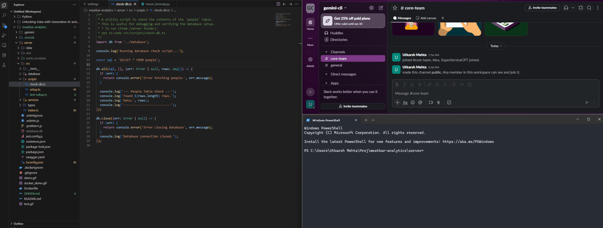
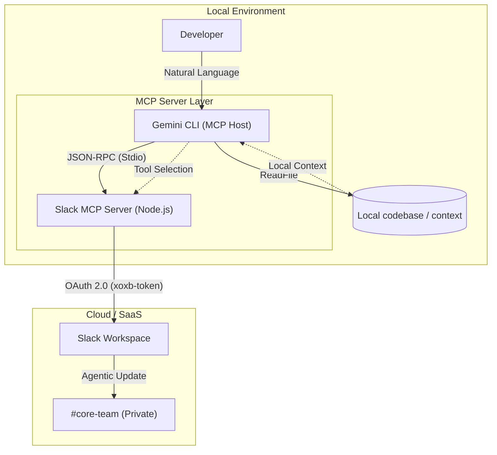

# Agentic SDLC Orchestrator — Secure, Protocol-Driven Automation

A reference implementation that demonstrates how to build secure, auditable, and autonomous developer workflows using the Model Context Protocol (MCP) and the Gemini CLI. This repository showcases an enterprise-capable pattern for combining Local RAG (retrieval-augmented generation), protocol-based orchestration, and constrained tool execution so that agents can act safely on developer environments.

Why this repo matters: it shows how to move from chat-style assistants to action-capable agents while keeping sensitive code local, auditable, and governed — the kind of pragmatic, security-first automation a senior engineering team needs.

---

## Demo / Quick Overview


This project demonstrates an "agentic loop" where an LLM-based reasoning host discovers a problem in a local codebase, proposes and (optionally) applies a fix, verifies it, and reports results to a private Slack channel — all mediated by MCP and constrained by project playbooks.

High level flow:
- The Gemini CLI runs as an MCP host (local reasoning).
- Tooling (e.g., a Slack MCP server) runs as isolated MCP servers and performs actions on behalf of the host.
- Local context and project playbooks (.gemini.md) form a Local RAG layer so the agent operates with project-specific knowledge and governance.

---

## Key Features

- Protocol-Driven Orchestration
  - Uses MCP (Model Context Protocol) to standardize communication between the LM host and tool servers.
- Local RAG & Playbooks
  - Project playbooks (.gemini.md) provide schema, style, and operational constraints so the agent follows team norms.
- Secure, Audited Actions
  - Execution is decoupled: reasoning runs locally; actions are performed through authenticated MCP servers that enforce scopes and logging.
- Enterprise-Ready Slack Integration
  - Example Slack MCP server implemented in Node.js with granular OAuth scopes and bot tokens for private workspace reporting.
- Developer-Centric Automation
  - Automates reporting and triage to reduce context switching, improve mean-time-to-resolution (MTTR), and keep human-in-the-loop verification.

---

## Technical Architecture

The architecture intentionally decouples reasoning from execution to minimize blast radius and improve auditability.



---

## Configuration & Security

This reference prioritizes security and operational safety:

- Transport security: MCP uses JSON-RPC over Stdio (or other secure channels) so local code rarely leaves the developer machine.
- Least privilege: Bot tokens and OAuth scopes are minimized (e.g., chat:write, channels:read).
- Governance: .gemini.md playbooks constrain agent actions (for example: "Always verify fixes in a sandbox before posting to Slack").
- Auditability: All agent actions should be logged and reversible; prefer proposals + review over automatic commits in production repositories.

---

## Install & Run

1. Install the Gemini CLI (host)
```bash
npm install -g @google/gemini-cli
```

2. Configure a Slack MCP Server in your Gemini settings (e.g., `~/.gemini/settings.json`):
```json
{
  "mcpServers": {
    "slack": {
      "command": "npx",
      "args": ["-y", "@modelcontextprotocol/server-slack"],
      "env": { "SLACK_BOT_TOKEN": "YOUR_XOXB_TOKEN" }
    }
  }
}
```

3. Add a `.gemini.md` playbook to the project root to define persona, policies, and local RAG sources.

4. Launch the agent from your project root:
```bash
gemini
```

---

## Example: Intentional "Bait" for the SRE Agent

This repo intentionally includes a small script that contains a known SQL bug so the agent can demonstrate diagnosis and a fix. File reference:

- check-db.ts (example): https://github.com/utkarshmehta/meatbar-analytics/blob/016fe565e4d0258b1bb49afa10b358f7d2a4989d/server/src/scripts/check-db.ts#L11

Excerpt (illustrative):
```ts
// DB Health Check Script
// This script is used by the SRE agent to verify connectivity.
//
// KNOWN BUG: The query is incomplete for testing the agentic loop.
async function runHealthCheck() {
  console.log("Checking database connectivity...");
  // The agent should find and fix the incomplete SELECT statement below
  const query = "SELECT * FROM analytics_logs WHERE status = 'ERROR' LIMIT;";
  console.log(`Executing query: ${query}`);
  // Simulated DB Execution logic here...
}
runHealthCheck();
```

An agent should:
- Detect the malformed SQL (e.g., `LIMIT;` has no row count),
- Propose a safe fix (for example `LIMIT 100` or remove LIMIT entirely depending on intent),
- Run the check in a sandbox or with clear confirmation, and
- Report and log the change to the configured channel.

---

## Usage & Best Practices

- Always run agents locally and review proposals before applying changes to production code.
- Keep `.gemini.md` playbooks updated with acceptable scopes (what can/can’t be changed automatically).
- Store tokens in secure secrets stores and rotate bot tokens regularly.
- Use CI to validate any agent-made code changes and require human approvals for sensitive areas.

---

---


If you want to discuss secure agent patterns, architecture trade-offs, or collaborate on hardening this reference, reach out via GitHub.

---
