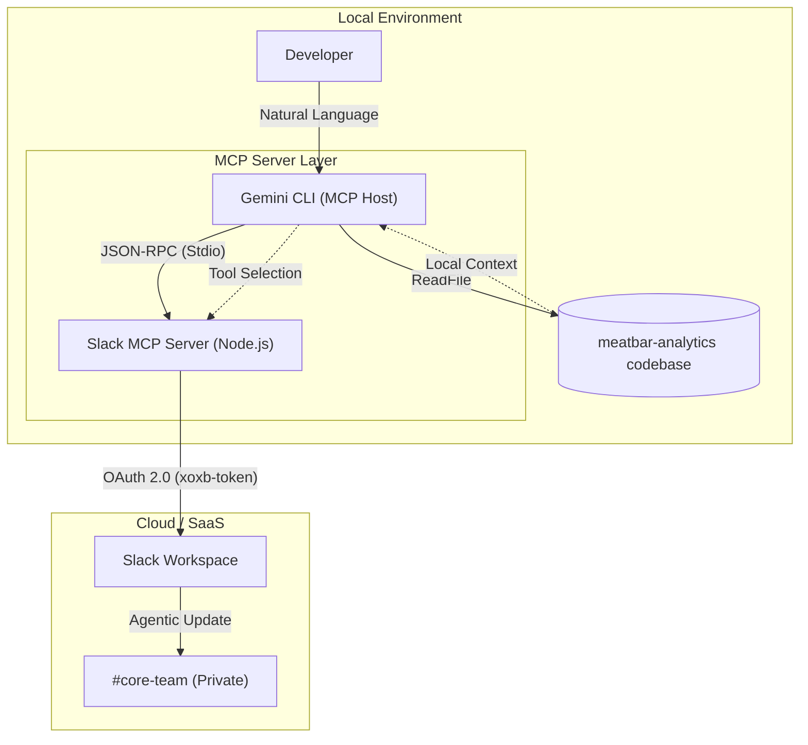

# Agentic SDLC Orchestrator: Bridging Local RAG with Enterprise SaaS

A reference implementation of a secure, autonomous debugging and reporting loop using the **Model Context Protocol (MCP)** and **Gemini CLI**.

## Demo

---

### 📖 Overview
This project demonstrates a shift from "Chat-based AI" to **"Agentic Action"**. It orchestrates a multi-platform workflow where an AI agent autonomously diagnoses a local codebase error, executes a fix, and synchronizes the resolution to a private Slack #core-team channel—all via a standardized, secure protocol layer.

---

### ✨ Key Features
* **Protocol-Driven Orchestration**: Uses MCP to standardize communication between the LLM and disparate tools (Filesystem, Slack).
* **Context-Aware Debugging**: Implemented a **Local RAG** layer via `.gemini.md` playbooks, ensuring the agent understands project-specific schemas and coding standards.
* **Secure Multi-Platform Action**: Configured an authenticated **Node.js Slack Server** with granular OAuth scopes to interact with private workspace channels.
* **Automated Dev-Sync**: Eliminates context-switching by automating the reporting phase of the software development lifecycle (SDLC).

---

### 🚀 Technical Architecture
The system follows a **Host-Server architecture** where the reasoning layer is entirely decoupled from the tool execution layer for maximum security and extensibility.

### 🔧 Configuration & Security
As a reference for enterprise-grade automation, this project prioritizes security at the edge:

Transport Security: All tool discovery and execution occurs over JSON-RPC via Stdio, ensuring sensitive local code never leaves the developer's machine.

Authentication: Uses long-lived Bot User OAuth Tokens with restricted scopes (chat:write, channels:read).

Governance: Implemented via .gemini.md instructions that define strict operational boundaries (e.g., "Always verify fixes before posting to Slack").

### 📦 Installation

# 1. Install the Gemini CLI
npm install -g @google/gemini-cli

# 2. Configure the Slack MCP Server in ~/.gemini/settings.json
{
  "mcpServers": {
    "slack": {
      "command": "npx",
      "args": ["-y", "@modelcontextprotocol/server-slack"],
      "env": { "SLACK_BOT_TOKEN": "YOUR_XOXB_TOKEN" }
    }
  }
}

# 3. Launch the agent in the project root
gemini

FILE: check-db.ts https://github.com/utkarshmehta/meatbar-analytics/blob/016fe565e4d0258b1bb49afa10b358f7d2a4989d/server/src/scripts/check-db.ts#L11

DB Health Check Script

This script is used by the SRE agent to verify connectivity.

KNOWN BUG: The query is incomplete for testing the agentic loop. */

async function runHealthCheck() { console.log("Checking database connectivity...");

// The agent should find and fix the incomplete SELECT statement below
const query = "SELECT * FROM analytics_logs WHERE status = 'ERROR' LIMIT;"; 

console.log(`Executing query: ${query}`);
// Simulated DB Execution logic here...
}

runHealthCheck();

---

### How to use this block:
1.  **README.md**: Create this in your project root to provide the "Big Picture" for GitHub visitors.
2.  **.gemini.md**: This is your "Instruction Manual." Place it in the same folder so the Gemini CLI picks up your SRE persona automatically.
3.  **check-db.ts**: This is the "Bait." It contains the SQL bug you showed in your video, allowing others (or your own agent) to reproduce the workflow.
